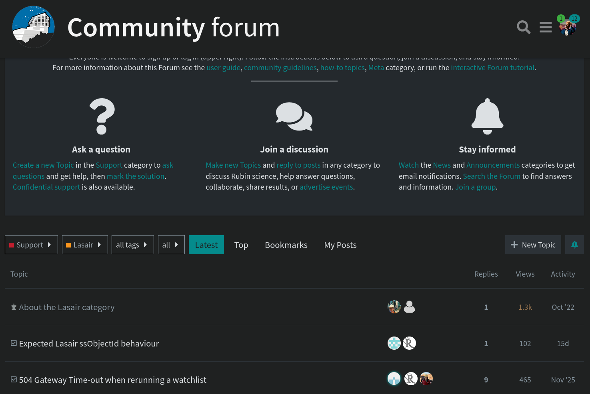

<p align="center">

</p>

<h1 align="center">  Lasair LSST Tutorials </h1>


This repository is dedicated to a suite of tutorials to help you get started with using Lasair to accept the LSST Alert data. 
For Further information we have [ReadTheDocs](https://lasair-lsst.readthedocs.io/en/main/) pages, and their relevant subsections will be sign posted where relevant in these tutorials 


## How to use these examples?

There are three kinds of resources:
* **Tutorials** which are detailed jupyter notebooks detailing our **API recipes**, our **kafka streams** and **how to handle the data** (e.g. make lightcurves, plot cut-outs)
* **Understans the features**: These notebooks are step-by-step explainers on how some key Lasair features (e.g. Extinction Corrected magnitudes, Balack Bpdy Bazin fits, Jump1 and Jump2) are calculated. You can run these noteooks and play with them, but it is typically not code you will then copy into you utilities. 
* **Template Scripts**: Full python scripts with detailed comments so you have ready to go utilities without having to paste bits of notebooks to piece together your code. 


## Pre-requisites

1. Install `lasair` python client

```
pip3 install lasair
```

2. A Valid Token (only for API / Kafka does not require a token)

You'll need to [register](https://lasair-lsst.lsst.ac.uk/register) to the Lasair platform so you can find your personal token on your [Profile](https://lasair-lsst.lsst.ac.uk/profile) page. 

**DO NOT SHARE THIS TOKEN WITH ANYOME**

## Have Any Suggestions? 

Feel free to fork this repository to propose changes, or open an issue to make a request. 

## How to get help?

If you have a question or need any help, you can find past questions or as a new one on the **[Community Forum](https://community.lsst.org/c/support/support-lasair/55)**.





